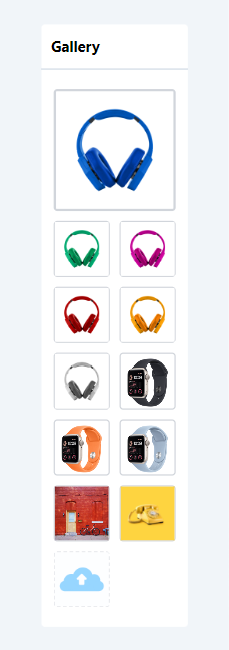
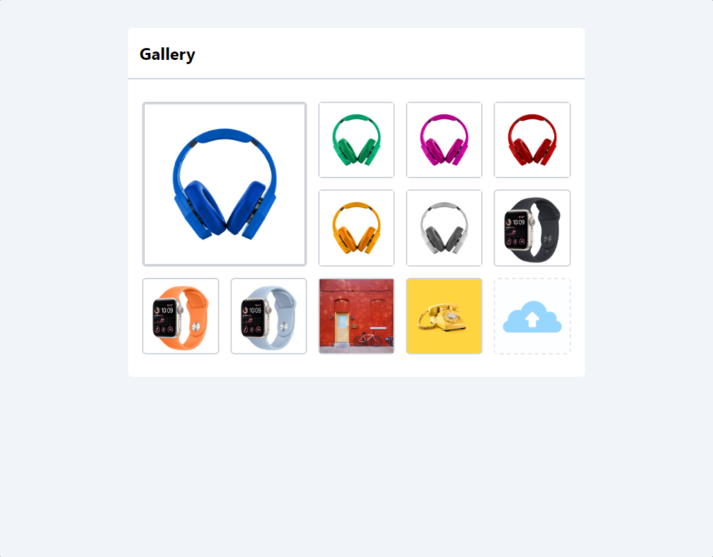
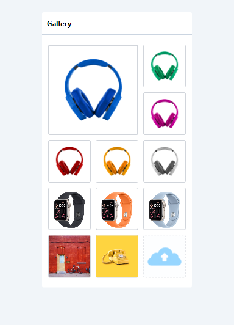

# React JS Image Gallery

This is a React JS image gallery project that allows users to view and interact with a gallery of images. The gallery features a grid layout, sorting, the ability to delete multiple images, and the option to set a feature image. It provides a smooth and responsive user experience with transitions and animations.

## Live Demo

You can interact with the live demo of this project by visiting https://ollyo-job-task.netlify.app/

## Features

### Gallery Layout:

- The gallery displays images in a grid layout.
- One image is featured, appearing larger than the others.

### Sorting:

- Users can reorder the images using drag-and-drop functionality(Custom drag-and-drop Create no library Use).
- Images can be arranged to their desired order.

### Deleting Multiple Images:

- Multiple images can be selected and deleted.
- Selected images are visually indicated for clarity.

### Setting Feature Image:

- The first image from the left-to-right direction is set as the featured image.
- The feature image is visually distinct from the other images.

### User Experience:

- The app provides a smooth and responsive user experience.
- Transitions and animations are used to enhance the look and feel.

## Also Implement Image Upload Functionality

## Technology Use

- React js
- Tailwind Css

## Screenshots

